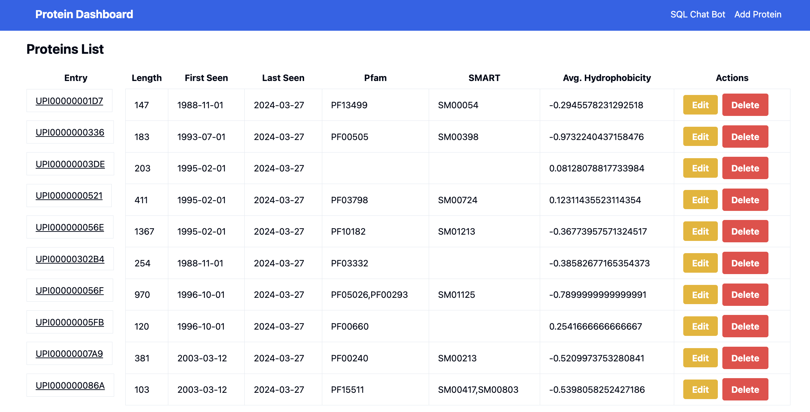
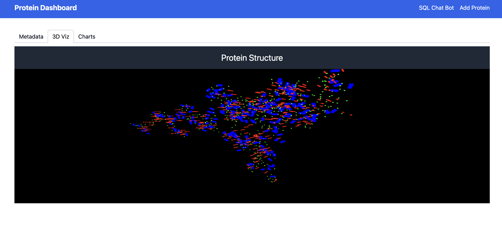
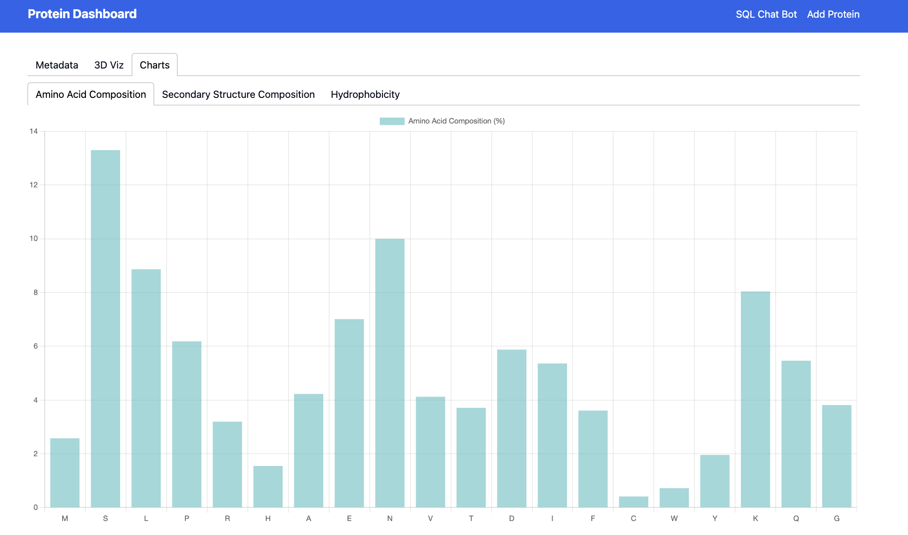

# [Protein Dashboard](https://protein-dashboard-unlock-8dyrz39.gamma.site/)

This project is a comprehensive web application designed to interact with a protein database. It includes functionalities for creating, reading, updating, and deleting protein data, as well as advanced features like an AI chatbot for SQL query generation and visualizations using Three.js.


## Features

- **CRUD Operations**: Create, Read, Update, and Delete protein data.
- **Chatbot**: Interact with the protein database using natural language.
- **Visualizations**: 3D visualizations of protein data using Three.js.
- **Charts**: Various charts to represent protein data statistics.
- **Responsive UI**: Built with React, TypeScript, Tailwind CSS, and Shadcn UI components.

## Technologies Used

- **Backend**: FastAPI, PostgreSQL, SQLAlchemy, Pydantic
- **Frontend**: React, TypeScript, Tailwind CSS,  Chart.js, Three.js
- **AI Integration**: OpenAI GPT-4
- **Deployment**: Docker, AWS Elastic Beanstalk, AWS RDS

## Screenshots

**Proteins List**

The main landing page features a list of proteins with columns for entry ID, length, first seen date, last seen date, PFAM, SMART, and average hydrophobicity. Each row includes "Edit" and "Delete" buttons for managing protein records.


**Protein Structure Visualization:**

This screenshot shows the "3D Viz" tab, where the 3D visualization of the protein structure is rendered. The visualization uses different colors to represent various elements and structures within the protein, providing an interactive view.


**SQL Chat Bot:**

The chat interface allows users to interact with a SQL-based chatbot. Users can type queries related to protein data, and the chatbot responds with the requested information. The interface shows both the user's input and the chatbot's responses, formatted in a conversational style.


**2D Visualizations:**

The screenshot shows a tabbed interface for visualizing protein data. The active tab, "Amino Acid Composition," displays a bar chart representing the percentage composition of various amino acids in the protein. Other tabs include "Secondary Structure Composition" and "Hydrophobicity," providing different data visualizations.



## Getting Started

### Prerequisites

- Docker
- Node.js
- Python 3.9+
- PostgreSQL

### Environment Variables

Create a `.env` file in the root directory with the following content:

```env
OPENAI_API_KEY=your_openai_api_key
DATABASE_URL=your_database_url
```

### Local Development

1. **Backend Setup**:

    ```sh
    docker build -t protein-dashboard-backend .
    docker run --env-file .env -p 8000:8000 protein-dashboard-backend
    ```

2. **Frontend Setup**:

    ```sh
    cd frontend
    npm install
    npm start
    ```

### API Endpoints

- **GET /proteins/**: Retrieve all proteins
- **GET /proteins/{entry}**: Retrieve a protein by entry
- **POST /proteins/**: Create a new protein
- **PUT /proteins/{entry}**: Update a protein
- **DELETE /proteins/{entry}**: Delete a protein
- **GET /protein-stats/{entry}**: Get statistics for a specific protein
- **POST /query/**: Generate SQL query using OpenAI

### Deployment

1. **Build and Push Docker Image**:

    ```sh
    docker build -t your_dockerhub_username/protein-dashboard-backend .
    docker push your_dockerhub_username/protein-dashboard-backend
    ```

2. **Deploy on AWS Elastic Beanstalk**:

    - Create an Elastic Beanstalk environment
    - Configure the environment to use Docker
    - Set up environment variables in the Elastic Beanstalk configuration

### Troubleshooting

- **CORS Issues**: Ensure CORS middleware is correctly set up in FastAPI.
- **SSL Termination**: Make sure the load balancer is properly configured for HTTPS.

### Contact

For any questions or issues, please contact [parthasarathy.d@northeastern.edu] or feel free to reach out to me on [LinkedIn](https://www.linkedin.com/in/parthadhruv/).

## License
This project is licensed under the MIT License.
